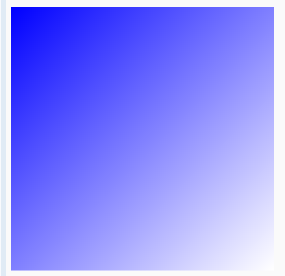
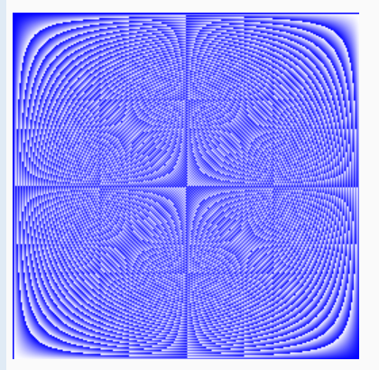
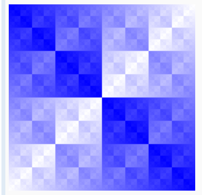
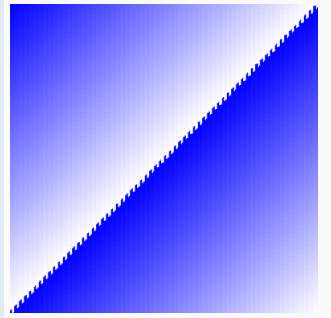

# Exercise: Slices

Implement Pic. It should return a slice of length dy, each element of which is a slice of dx 8-bit unsigned integers. When you run the program, it will display your picture, interpreting the integers as grayscale (well, bluescale) values.

The choice of image is up to you. Interesting functions include `(x+y)/2`, `x*y`, and `x^y`.

(You need to use a loop to allocate each []uint8 inside the [][]uint8.)

(Use uint8(intValue) to convert between types.)

## Pic Function
This program implements a function Pic(dx, dy int) [][]uint8 that generates a grayscale image represented as a 2D slice of 8-bit unsigned integers (uint8). The function returns a dy by dx slice, where each element represents a pixel, and the pixel values are computed based on the coordinates.

### How It Works
- The image is constructed using nested loops:

  - The outer loop iterates over the rows (height) of the image.
  - The inner loop iterates over the columns (width) of each row.
- For each pixel, the grayscale value is calculated using the formula x^2 + y^2, where x and y are the pixel's column and row indices, respectively. The result is converted to a uint8 value, which maps to the pixel's intensity.
- The image is displayed using the pic.Show function, which interprets the pixel values as grayscale shades.
  
### Example of Execution
  The program will produce a pattern of values based on the XOR operation between the squared coordinates of each pixel, resulting in a visually interesting pattern. The image is displayed using the `pic.Show(Pic)` function from the `golang.org/x/tour/pic package`.

## Results
| `(x+y)/2`               | `x*y`                   |
|-------------------------|-------------------------|
|  |      |
| `x^y`                   | `x^2+y^2`               |
|  |  |